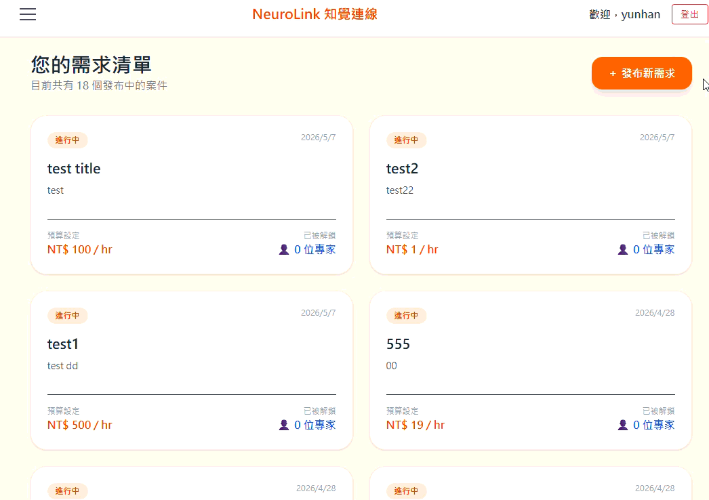
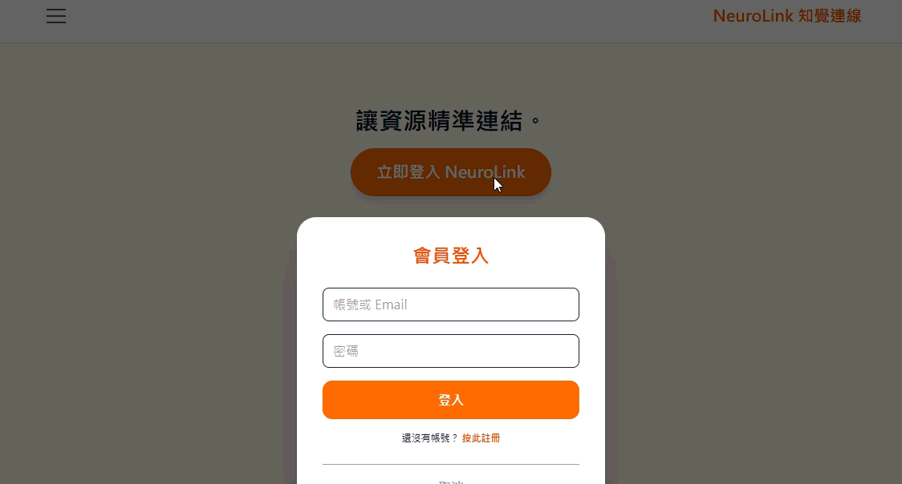

# 🧠 NeuroLink 知覺連線 - 特教資源媒合平台

> **🔒 原始碼存取聲明 (Source Code Access)**
> 本專案為本人獨立開發之完整全端系統，因未來具備商業化營利規劃，**核心原始碼目前存放於 Private Repository**。
> 本 Public Repository 旨在展示系統的**架構設計、UI/UX 互動以及核心商業邏輯**。如有技術面試或深入技術探討之需求，非常歡迎於面試時直接展示原始碼並討論設計細節！

---

## 🎥 系統實機展示 (System Demo)

### 1. 快速登入與漸進式引導 (Login & Onboarding)
家長與專家分流登入。系統導入漸進式體驗，讓尚未完善履歷的專家能先預覽全站案件產生動機，再引導至專屬頁面建檔。

  

### 2. 家長發布需求 (Post a Request)
家長端專屬介面，可直覺地設定案件預算、選擇診斷標籤並填寫詳細狀況，發布後即時同步至全站案件池。

  

### 3. 專家預覽案件 (Preview & Unlock Cases)
專家端可瀏覽最新需求卡片。在詳情頁中，透過平台點數 (P幣) 系統解鎖家長聯絡資訊。系統同時具備嚴格的「審核狀態防呆機制」。

  

---

## ✨ 核心功能 (Key Features)

- **🔐 角色化存取控制 (RBAC)**：支援 `PARENT` (家長)、`EXPERT` (專家)、`ADMIN` (管理員) 三種身分，並透過 JWT 進行安全的狀態驗證。
- **🚀 漸進式註冊與審核機制 (Progressive Onboarding)**：
  - 雙分段註冊系統：使用 Email 驗證碼暫存表 (VerificationRecord) 保障主用戶表 (Users) 的資料完整性。
  - 專家註冊後可預覽全站案件產生動機 (FOMO)，但須引導完善「專業履歷」並經後台審核 (Pending Approval) 後方可接案。
- **💎 點數經濟與解鎖系統**：家長免費發布需求，專家透過消耗平台點數 (P幣) 解鎖家長的聯絡資訊。
- **🔎 全站模糊檢索 (Global Search)**：後台支援跨欄位 (Email, 姓名, 標籤等) 的高效模糊搜尋機制。
- **🎨 現代化 UX/UI**：基於 Tailwind CSS 打造高質感的響應式介面，包含專家履歷數位名片 (Modal) 與流暢的狀態引導。

## 🛠️ 技術堆疊 (Tech Stack)

### Backend (後端)
- **Framework**: Java, Spring Boot 3
- **Security**: Spring Security, JWT (JSON Web Tokens)
- **Database**: PostgreSQL, Spring Data JPA, Hibernate
- **Tools**: Lombok, JavaMailSender

### Frontend (前端)
- **Framework**: Vue 3 (Composition API)
- **Router/State**: Vue Router, Pinia
- **Styling**: Tailwind CSS
- **HTTP Client**: Axios

